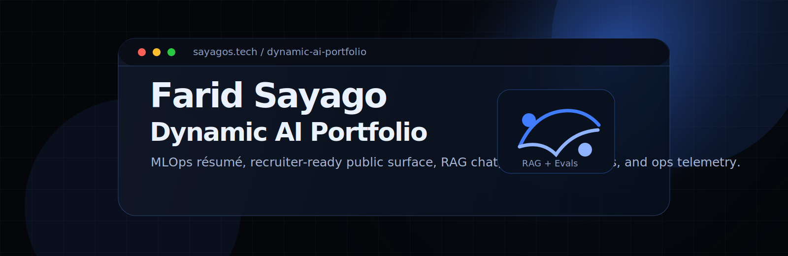
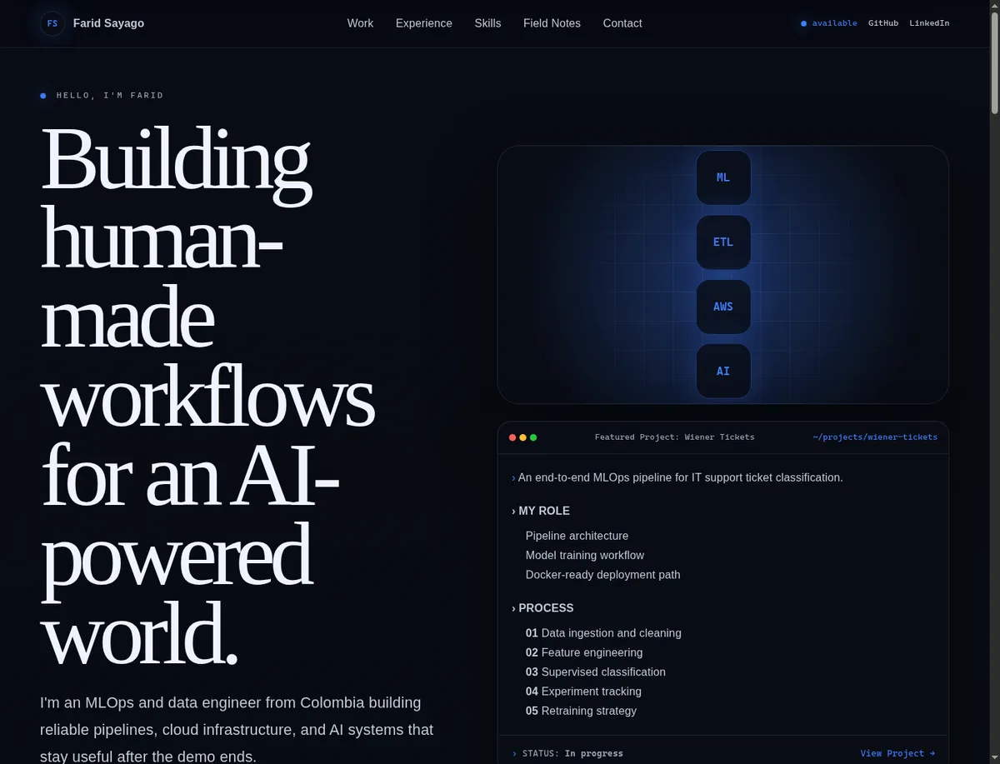
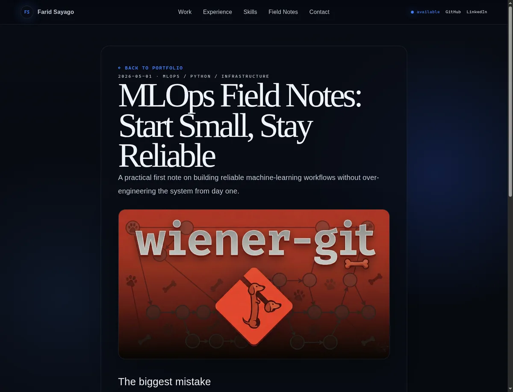

<p align="center">
  
</p>

<p align="center">
  <a href="https://sayagos.tech"></a>
  
  
  
  
</p>

# Farid Sayago — Dynamic AI Portfolio

This is Farid Sayago's production portfolio: a recruiter-facing CV, a project showcase, and an AI assistant that can explain the work behind the page.

Most portfolios stop at screenshots. This one keeps the proof close to the surface: selected projects, experience, field notes, RAG-backed chat, voice mode, evals, tracing, and an ops dashboard for the AI layer.

> [!NOTE]
> The public identity and portfolio facts come from `src/content/farid-profile.ts`. If you fork this repo, replace that module first.

## For recruiters

Farid is a Colombia-based Data Scientist / MLOps Engineer / Data Analyst focused on Python, SQL, machine learning workflows, data pipelines, cloud infrastructure, and practical AI systems.

This portfolio is built to make the first review faster:

- **Clear positioning:** MLOps and data engineering for systems that stay useful after the demo.
- **Project evidence:** Git internals in Python, an HTTP server in C, and a reproducible ticket-classification pipeline.
- **Career context:** Intcomex, Universidad Santo Tomás, and Kimberly-Clark experience are presented from the same source used by RAG and evals.
- **Interactive proof:** The AI assistant can answer questions about Farid's work and cite portfolio sources when RAG is available.
- **Operational maturity:** The AI layer includes eval datasets, adversarial tests, Langfuse tracing, Supabase search, and an ops dashboard.

## Screenshots

<p align="center">
  
</p>

<p align="center">
  
</p>

## Main functions

| Area | What it does |
| --- | --- |
| Portfolio surface | Static recruiter-facing home, selected work, experience, skills, field notes, and contact. |
| Text chat | Portfolio assistant for questions about Farid's projects, skills, and experience. |
| Voice mode | Spoken portfolio assistant with concise answers and RAG search support. |
| RAG pipeline | Exports public-safe knowledge from `public/llms.txt`, embeds it, and stores chunks in Supabase. |
| Evals | JSON datasets for persona, factual accuracy, RAG behavior, safety, language matching, quality, and voice. |
| Ops dashboard | Internal dashboard for conversations, RAG health, costs, evals, voice, security, and system status. |
| SEO/prerender | Sitemap, static prerender, JSON-LD, `llms.txt`, and validation scripts. |

## Architecture at a glance

```text
Hostinger static frontend
  ├─ React/Vite portfolio
  ├─ EmailJS contact form
  └─ Public SEO/prerender output

Vercel API / LLMOps
  ├─ /api/chat
  ├─ /api/rag-search
  ├─ /api/voice-token
  ├─ /api/ops/*
  └─ scheduled eval jobs

External services
  ├─ Anthropic: chat + judging
  ├─ OpenAI: embeddings
  ├─ Supabase: vector/keyword search
  ├─ Langfuse: traces + prompt ops
  └─ EmailJS: public contact form
```

## Run locally

```bash
npm install
npm run dev
```

Build and validate the public surface:

```bash
npm run lint
npm run build
npm run validate-llms-txt
npx tsx --tsconfig tsconfig.app.json scripts/generate-sitemap.ts
npx tsx --tsconfig tsconfig.app.json scripts/prerender.tsx
npx tsx --tsconfig tsconfig.app.json scripts/validate-prerender.ts
```

RAG and eval commands:

```bash
npm run rag:export
npm run rag:ingest
npm run evals
npm run adversarial
npm run prompt:regression
npm run test:ops
```

## Environment

Start from `.env.local.example`.

Frontend variables:

```env
VITE_API_BASE_URL=https://api.sayagos.tech
VITE_APP_EMAILJS_SERVICE_ID=
VITE_APP_EMAILJS_TEMPLATE_ID=
VITE_APP_EMAILJS_PUBLIC_KEY=
```

API/LLMOps variables:

```env
ANTHROPIC_API_KEY=
OPENAI_API_KEY=
SUPABASE_URL=
SUPABASE_SERVICE_ROLE_KEY=
LANGFUSE_PUBLIC_KEY=
LANGFUSE_SECRET_KEY=
OPS_DASHBOARD_SECRET=
CORS_ORIGIN=https://sayagos.tech
```

> [!IMPORTANT]
> Do not reuse Farid's Supabase, Langfuse, prompt, RAG, or eval data for another person. Fork the architecture, not the identity.

## Forking this project

### If you are a human contributor

1. Fork the repo and create a branch from `main`.
2. Replace `src/content/farid-profile.ts` with your own public-safe facts.
3. Update `public/llms.txt` and run `npm run validate-llms-txt`.
4. Replace screenshots and project images under `public/images` and `docs/assets`.
5. Use fresh Supabase and Langfuse projects.
6. Keep secrets out of the static frontend. API keys belong on Vercel or your backend host.
7. Run the validation commands before opening a PR.

### If you are an agent

Read these first:

- `AGENTS.md`
- `CONTEXT.md`
- `.pi/plans/*` when a plan exists

Then follow this order:

1. Treat `src/content/farid-profile.ts` as the truth source.
2. Keep public copy, SEO, evals, `public/llms.txt`, and RAG chunks synchronized.
3. Do not remove advanced modules unless the user explicitly asks.
4. Do not invent dates, credentials, metrics, companies, or certifications.
5. Use deep modules and seams instead of scattering facts through UI files.
6. Update the Obsidian portfolio notes for durable decisions.

## Using it as inspiration

This repo works best as a blueprint for a living CV:

- make the profile data canonical;
- give recruiters a fast first scan;
- let the AI assistant answer from approved public facts;
- test the assistant with evals before shipping;
- keep deployment split between static frontend and secret-bearing API modules.

The design can change. The important part is the contract: one truth source, public-safe knowledge, tested AI behavior, and a portfolio that explains the work without making recruiters hunt for it.
